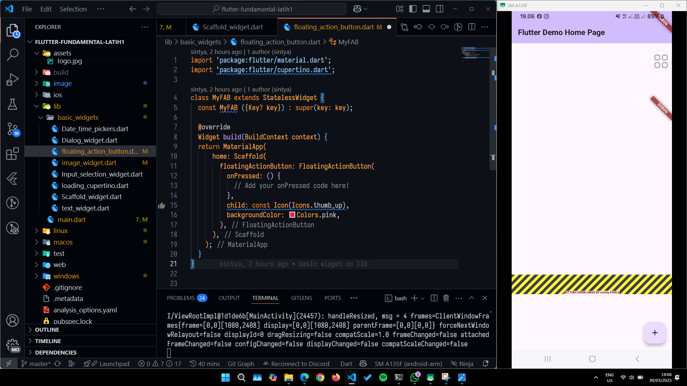

Berikut adalah hasil tangkapan gambar dalam menerapkan praktikum4 yaitu Menerapkan Widget Dasar. Langkah 1 membuat Text Widget sebagai berikut

Berikut adalah hasil tangkapan gambar dalam menerapkan praktikum4 yaitu Menerapkan Widget Dasar. Langkah 2 membuat Image Widget sebagai berikut

Berikut adalah hasil tangkapan gambar dalam menerapkan praktikum5 yaitu Menerapkan Widget Material Design dan iOS Cupertino. Langkah 1 membuat Cupertino Button dan Loading Bar sebagai berikut

Berikut adalah hasil tangkapan gambar dalam menerapkan praktikum5 yaitu Menerapkan Widget Material Design dan iOS Cupertino. Langkah 2 membuat Floating Action Button (FAB) sebagai berikut

Berikut adalah hasil tangkapan gambar dalam menerapkan praktikum5 yaitu Menerapkan Widget Material Design dan iOS Cupertino. Langkah 3 membuat Scaffold Widget sebagai berikut

Berikut adalah hasil tangkapan gambar dalam menerapkan praktikum5 yaitu Menerapkan Widget Material Design dan iOS Cupertino. Langkah 4 membuat Dialog Widget sebagai berikut

Berikut adalah hasil tangkapan gambar dalam menerapkan praktikum5 yaitu Menerapkan Widget Material Design dan iOS Cupertino. Langkah 5 membuat Input dan Selection Widget sebagai berikut

Berikut adalah hasil tangkapan gambar dalam menerapkan praktikum5 yaitu Menerapkan Widget Material Design dan iOS Cupertino. Langkah 6 membuat Date and Time Pickers sebagai berikut

